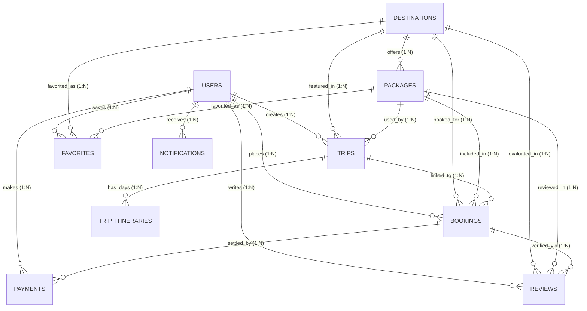

# Database Architecture & Implementation Guide (Phase 3)

Database: **`travel_booking_db`**  
Engine: **InnoDB**  
Default Character Set: **`utf8mb4`**  
Default Collation: **`utf8mb4_unicode_ci`**

---

## 1. Architecture Overview & ER Diagram

The database is designed with high referential integrity, strong data types, constraints, and optimized B-Tree indexes for fast queries across search, booking, itinerary planning, and user management workflows.



---

## 2. Table Specifications & Relationships

| # | Table | Primary Key | Foreign Keys | Key Constraints & Indexes |
|---|---|---|---|---|
| 1 | **`users`** | `id` (BIGINT PK) | — | `email` UNIQUE, `role` ENUM, `idx_users_role`, `idx_users_is_active` |
| 2 | **`destinations`** | `id` (BIGINT PK) | — | `slug` UNIQUE, `CHECK (rating BETWEEN 0 AND 5)`, `idx_destinations_country_city`, `idx_destinations_category` |
| 3 | **`packages`** | `id` (BIGINT PK) | `destination_id` -> `destinations(id)` (CASCADE) | `slug` UNIQUE, `CHECK (duration_days >= 1)`, `CHECK (base_price >= 0)`, `idx_packages_destination_id` |
| 4 | **`trips`** | `id` (BIGINT PK) | `user_id` -> `users(id)` (CASCADE)<br>`destination_id` -> `destinations(id)` (RESTRICT)<br>`package_id` -> `packages(id)` (SET NULL) | `CHECK (end_date >= start_date)`, `idx_trips_user_id`, `idx_trips_status`, `idx_trips_dates` |
| 5 | **`trip_itineraries`** | `id` (BIGINT PK) | `trip_id` -> `trips(id)` (CASCADE) | `CHECK (day_number >= 1)`, `CHECK (cost >= 0)`, `idx_itineraries_trip_day` |
| 6 | **`bookings`** | `id` (BIGINT PK) | `user_id` -> `users(id)` (RESTRICT)<br>`trip_id` -> `trips(id)` (SET NULL)<br>`package_id` -> `packages(id)` (SET NULL)<br>`destination_id` -> `destinations(id)` (RESTRICT) | `booking_reference` UNIQUE, `CHECK (num_travelers >= 1)`, `CHECK (final_amount >= 0)`, `idx_bookings_user_id`, `idx_bookings_status` |
| 7 | **`payments`** | `id` (BIGINT PK) | `booking_id` -> `bookings(id)` (CASCADE)<br>`user_id` -> `users(id)` (RESTRICT) | `transaction_id` UNIQUE, `CHECK (amount >= 0)`, `idx_payments_booking_id`, `idx_payments_payment_status` |
| 8 | **`reviews`** | `id` (BIGINT PK) | `user_id` -> `users(id)` (CASCADE)<br>`destination_id` -> `destinations(id)` (CASCADE)<br>`package_id` -> `packages(id)` (CASCADE)<br>`booking_id` -> `bookings(id)` (SET NULL) | `CHECK (rating BETWEEN 1 AND 5)`, `idx_reviews_user_id`, `idx_reviews_destination_id`, `idx_reviews_package_id` |
| 9 | **`favorites`** | `id` (BIGINT PK) | `user_id` -> `users(id)` (CASCADE)<br>`destination_id` -> `destinations(id)` (CASCADE)<br>`package_id` -> `packages(id)` (CASCADE) | UNIQUE `(user_id, destination_id)`, UNIQUE `(user_id, package_id)` |
| 10 | **`notifications`** | `id` (BIGINT PK) | `user_id` -> `users(id)` (CASCADE) | `idx_notifications_user_unread`, `idx_notifications_type` |

---

## 3. Password Security & Hashing Standards

> [!IMPORTANT]
> **Passwords are NEVER stored in plain text.**  
> The system enforces industry-standard one-way cryptographic hashing:
> - **Algorithm**: `bcrypt` (Blowfish crypt) with automatic salting.
> - **Cost Factor / Salt Rounds**: `10` rounds (producing standard 60-character strings starting with `$2a$10$...` or `$2b$10$...`).
> - **Authentication Flow**: When a user registers or logs in, raw credentials are submitted over HTTPS, hashed using `bcrypt.hash()`, and compared using timing-safe `bcrypt.compare()`.

---

## 4. How to Execute the SQL Scripts

### Method A: Automated Node.js Script (Recommended)

From the project root:

```bash
cd backend
npm run db:setup
```

This runs `backend/scripts/setupDatabase.js`, which:
1. Connects to your MySQL server using credentials in `.env`.
2. Creates the database `travel_booking_db` if it doesn't already exist.
3. Executes `database/schema.sql` to build all 10 tables.
4. Executes `database/seed.sql` to load initial records.
5. Prints a validation summary.

To run verification queries:
```bash
npm run db:verify
```

---

### Method B: MySQL Command Line / MySQL Shell

Open Command Prompt or Terminal:

```bash
# 1. Login to MySQL
mysql -u root -p

# 2. Run Schema Creation
source c:/Users/priya/Downloads/travel_planning_and_booking/database/schema.sql;

# 3. Seed Initial Records
source c:/Users/priya/Downloads/travel_planning_and_booking/database/seed.sql;

# 4. Verify Tables
source c:/Users/priya/Downloads/travel_planning_and_booking/database/verify.sql;
```

---

### Method C: MySQL Workbench

1. Open **MySQL Workbench** and connect to your local MySQL instance.
2. Go to **File -> Open SQL Script...** (or press `Ctrl+Shift+O`).
3. Select `database/schema.sql` and click the **⚡ Execute** button.
4. Open `database/seed.sql` and click **⚡ Execute**.
5. Open `database/verify.sql` and click **⚡ Execute** to inspect verification output.

---

## 5. How to Verify Each Table

Run the following SQL statements in MySQL:

```sql
USE `travel_booking_db`;

-- Check all tables
SHOW TABLES;

-- Inspect table structures
DESCRIBE `users`;
DESCRIBE `destinations`;
DESCRIBE `packages`;
DESCRIBE `trips`;
DESCRIBE `trip_itineraries`;
DESCRIBE `bookings`;
DESCRIBE `payments`;
DESCRIBE `reviews`;
DESCRIBE `favorites`;
DESCRIBE `notifications`;

-- Verify foreign keys and table counts
SELECT TABLE_NAME, TABLE_ROWS 
FROM information_schema.TABLES 
WHERE TABLE_SCHEMA = 'travel_booking_db';
```
